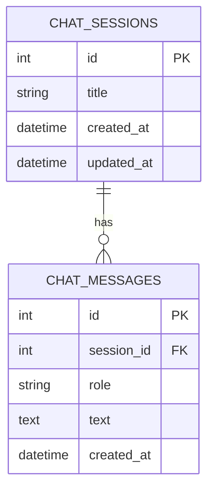
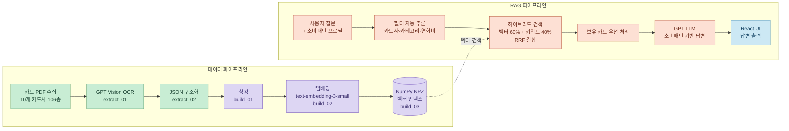
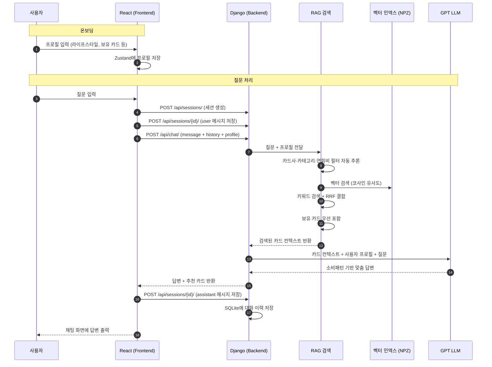

# SKN25-4th-6Team

# RAIchU
<div align="center">
  
</div>

### Real AI Card Hub System for U — 소비패턴 기반 개인 맞춤형 신용카드 추천 RAG 챗봇

<br>

## 프로젝트 소개

> **"내 소비 패턴에 맞는 카드, AI가 실제 약관 데이터를 기반으로 추천해드립니다"**

3차 프로젝트(PickCardU)의 경험을 바탕으로, 더 정확한 데이터 파이프라인과 현대적인 웹 아키텍처로 고도화한 신용카드 추천 서비스입니다.

**RAIchU**는 GPT Vision OCR로 추출한 카드 약관 데이터를 구조화 JSON으로 변환하고,
하이브리드 검색(벡터 + 키워드)으로 사용자 질문에 가장 적합한 카드를 찾아
사용자의 소비패턴과 라이프스타일에 맞춘 맞춤형 상담을 제공합니다.

<br>

## 프로젝트 기간

**2026.04.14 ~ 2026.04.28** (SK Networks AI Camp 25기 · 6팀 · 4차 미니 프로젝트)

<br>

## 팀원 소개

<table>
  <tr>
    <td align="center"></td>
    <td align="center"></td>
    <td align="center"></td>
    <td align="center"></td>
    <td align="center"></td>
  </tr>
  <tr>
    <td align="center"><b>박연정</b><br>팀장</td>
    <td align="center"><b>김서현</b><br>팀원</td>
    <td align="center"><b>박지현</b><br>팀원</td>
    <td align="center"><b>신문수</b><br>팀원</td>
    <td align="center"><b>이근혁</b><br>팀원</td>
  </tr>
  <tr>
    <td align="center"><a href="https://github.com/yeony-park">@yeony-park</a></td>
    <td align="center"><a href="https://github.com/bizseohyunkim">@bizseohyunkim</a></td>
    <td align="center"><a href="https://github.com/qkrwlgus89">@qkrwlgus89</a></td>
    <td align="center"><a href="https://github.com/anstn3375">@anstn3375</a></td>
    <td align="center"><a href="https://github.com/keunlee726">@keunlee726</a></td>
  </tr>
</table>

<br>

## 3차 대비 주요 변경사항

| 항목 | 3차 (PickCardU) | 4차 (RAIchU) |
|------|----------------|--------------|
| 프론트엔드 | Streamlit | React 19 + Vite + Tailwind CSS |
| 백엔드 | Streamlit 내장 | Django REST Framework |
| OCR | EasyOCR / PyPDF | GPT-5.4-mini Vision |
| 데이터 구조 | 원시 텍스트 청킹 | JSON 구조화 후 청킹 |
| 벡터 DB | ChromaDB | NumPy NPZ (자체 구현) |
| RAG 검색 | 유사도 검색 단일 | 하이브리드 (벡터 60% + 키워드 40%, RRF) |
| 개인화 기준 | MBTI | 소비패턴 (라이프스타일, 월 사용액, 연회비 허용 등) |
| 카드 수 | ~50개 | 106개 |

<br>

## 주요 기능

| 기능 | 설명 |
|------|------|
| 온보딩 | 나이대·자동차·연회비·라이프스타일·월 사용액·보유 카드·선호 혜택 설정 |
| 카드 추천 | 소비패턴 기반 맞춤 카드 추천 (RAG) |
| 카드 Q&A | 카드 약관 기반 정확한 혜택 질의응답 |
| 보유 카드 우선 응답 | 보유 카드 관련 질문 시 해당 카드 데이터 우선 제공 |
| 대화 이력 | 채팅 세션 및 메시지 저장 (SQLite) |
| My Page | 보유 카드 추가/삭제 및 프로필 수정 |

<br>

## 프로젝트 구조

```
SKN25-4th-6Team/
├── docker-compose.yml
│
├── backend/                        # Django 백엔드
│   ├── manage.py
│   ├── requirements.txt
│   ├── Dockerfile
│   │
│   ├── config/                     # Django 설정
│   │   ├── settings.py
│   │   └── urls.py
│   │
│   ├── api/                        # REST API
│   │   ├── views.py                # chat / cards / sessions 엔드포인트
│   │   ├── urls.py
│   │   └── models.py               # SQLite 모델 (ChatSession 등)
│   │
│   ├── src/                        # 핵심 모듈
│   │   ├── extraction/
│   │   │   ├── extract_01_text_from_pdf.py   # GPT Vision OCR → txt
│   │   │   └── extract_02_structure_json.py  # txt → 구조화 JSON
│   │   ├── pipeline/
│   │   │   ├── build_01_chunks.py            # JSON → 청크
│   │   │   ├── build_02_embeddings.py        # 청크 → 임베딩
│   │   │   └── build_03_vector_index.py      # 임베딩 → NPZ 인덱스
│   │   ├── cards.py                # 카드 데이터 로딩
│   │   ├── retrieval.py            # 하이브리드 검색
│   │   ├── llm.py                  # LLM 답변 생성
│   │   ├── service.py              # 서비스 레이어
│   │   ├── context.py              # 컨텍스트 빌더
│   │   └── utils.py
│   │
│   ├── data/
│   │   ├── documents/
│   │   │   ├── raw/                # 원본 PDF (카드사별 폴더)
│   │   │   └── vision/             # OCR 결과 txt (카드사별 폴더)
│   │   └── cards/                  # 구조화 JSON (106개)
│   │
│   ├── vector_store/               # 벡터 인덱스
│   │   ├── chunks.jsonl
│   │   ├── embeddings.jsonl
│   │   ├── vector_index.npz
│   │   └── vector_meta.jsonl
│   │
│   ├── prompts/                    # Jinja2 프롬프트 템플릿
│   │   ├── system_prompt.j2
│   │   └── instructions/
│   │
│   ├── rag_config/                 # RAG 설정
│   │   ├── rag_settings.json
│   │   ├── card_category_rules.json
│   │   └── synonyms.json
│   │
│   └── scripts/
│       └── rebuild_rag_index.sh    # 벡터 인덱스 재빌드 스크립트
│
└── frontend/                       # React 프론트엔드
    ├── Dockerfile
    ├── vite.config.js
    └── src/
        ├── api/client.js           # Axios API 클라이언트
        ├── store/userStore.js      # Zustand 전역 상태
        └── pages/
            ├── SplashScreen.jsx
            ├── HomePage.jsx
            ├── OnboardingPage.jsx  # 프로필 설정 (3단계)
            ├── ChatPage.jsx        # RAG 채팅
            └── MyPage.jsx          # 보유 카드 · 프로필 관리
```

<br>

## 데이터 파이프라인

**10개 카드사 공식 홈페이지**에서 카드 상품 설명서 PDF를 수집하여 처리합니다.

| 단계 | 도구 | 설명 |
|------|------|------|
| PDF 수집 | - | BC, NH, 하나, 현대, 국민, 롯데, 삼성, 신한, 우리, IBK |
| OCR | GPT-5.4-mini Vision | PDF 페이지 이미지 → 텍스트 전사 |
| JSON 구조화 | GPT-5.4-mini | 텍스트 → 혜택/연회비/카테고리 구조화 JSON |
| 청킹 | 자체 구현 | 구조화 JSON 필드 단위 청킹 |
| 임베딩 | OpenAI text-embedding-3-small | 벡터 변환 |
| 벡터 저장 | NumPy NPZ | 코사인 유사도 기반 검색 |

<br>

## RAG 검색 전략

기존 단순 유사도 검색에서 **하이브리드 검색 + RRF(Reciprocal Rank Fusion)** 방식으로 변경했습니다.

- **벡터 검색 (60%)** : OpenAI 임베딩 기반 코사인 유사도 검색
- **키워드 검색 (40%)** : 토큰 오버랩 기반 검색
- **필터 자동 추론** : 질문에서 카드사·카테고리·연회비 구간 자동 파악
- **보유 카드 우선** : 보유 카드 관련 질문 시 owned cards 데이터 우선 제공
- **동의어 확장** : synonyms.json 기반 쿼리 확장

<br>

## ERD



<br>

## 시스템 아키텍처



<br>


## 핵심 기능 구현
 
### GPT Vision OCR + JSON 구조화
- `extract_01` : PDF 페이지를 이미지로 변환 후 GPT-5.4-mini Vision으로 텍스트 전사. 다단 레이아웃, 표, 특수기호 원문 보존
- `extract_02` : 전사된 텍스트를 GPT-5.4-mini로 분석해 혜택·연회비·카테고리·제외항목 등 구조화 JSON 생성. 기존 EasyOCR 대비 정확도 대폭 향상

### 하이브리드 RAG 검색
- 벡터 검색(코사인 유사도)과 키워드 검색(토큰 오버랩)을 RRF로 결합
- 질문에서 카드사·카테고리·연회비 구간을 자동 추론해 필터 적용
- 동의어 사전(synonyms.json) 기반 쿼리 확장으로 검색 recall 향상

### 소비패턴 기반 개인화
- 온보딩 시 나이대·라이프스타일·월 사용액·연회비 허용 범위·선호 혜택 수집
- 수집된 프로필을 LLM 프롬프트에 주입해 사용자 맞춤 답변 생성
- 보유 카드 관련 질문 시 해당 카드 데이터를 RAG 컨텍스트에 우선 포함

### 대화 이력 저장 (SQLite)
- 채팅 세션 단위로 대화 저장 (ChatSession, ChatMessage 모델)
- 프론트엔드가 세션 생성, 사용자 메시지 저장, 답변 메시지 저장 API를 순차 호출
- 사이드바에서 이전 대화 목록 조회 및 재진입 가능

<br>

## UI 와이어프레임
 
| 온보딩 | 채팅 화면 | 마이페이지 |
|:------:|:---------:|:---------:|
| 3단계 프로필 설정 | RAG 기반 카드 상담 | 보유 카드 · 프로필 관리 |
 
> 실제 스크린샷은 추후 추가 예정

<br>


## 시퀀스 다이어그램
 

 
<br>

## 시연 영상

### 사용자 설정 및 프로필 관리
초기 화면에서 사용자 프로필을 설정하고, My Page에서 프로필과 보유 카드를 수정할 수 있습니다.


### 카드 추천 및 혜택 안내
채팅으로 질문하면 RAG 기반으로 맞춤 카드 추천과 혜택 안내를 받을 수 있습니다.


<br>


## 실행 방법

### 환경변수 설정

`backend/.env` 파일을 생성하고 아래 내용을 입력하세요:

```env
DEBUG=True
SECRET_KEY=your-secret-key-change-me
ALLOWED_HOSTS=localhost,127.0.0.1,backend
CSRF_TRUSTED_ORIGINS=http://localhost:3000,http://localhost:5173
OPENAI_API_KEY=sk-...
```

`frontend/.env` 파일을 생성하세요:

```env
VITE_API_BASE_URL=http://localhost:8000
```

---

### Docker로 실행 (권장)

```bash
# 1. 레포지토리 클론
git clone https://github.com/SKNETWORKS-FAMILY-AICAMP/SKN25-4th-6Team.git
cd SKN25-4th-6Team

# 2. 백엔드 + 프론트엔드 실행
docker-compose up -d --build

# 3. 브라우저에서 접속
# 프론트엔드: http://localhost:3000
# 백엔드 API: http://localhost:8000
```

---

### 로컬 개발 실행

```bash
# 백엔드
cd backend
python -m venv .venv
source .venv/bin/activate
pip install -r requirements.txt
python manage.py migrate
python manage.py runserver 8000

# 프론트엔드
cd frontend
npm install
npm run dev
```

> `package.json`에 선언된 프론트엔드 의존성이 `node_modules`와 맞지 않으면 `react-markdown`, `remark-gfm` 같은 패키지 해석 오류로 빌드가 실패할 수 있습니다. 이 경우 `npm install`로 lockfile 기준 의존성을 다시 동기화하세요.

---

### 벡터 인덱스 재빌드 (카드 데이터 변경 시)

```bash
docker-compose exec backend bash scripts/rebuild_rag_index.sh
```

<br>

## 기술 스택

### Frontend


### Backend


### Database / Infra


### Tools


<br>

## 회고
> **박연정** : 4차 프로젝트에서는 GPT Vision OCR 파이프라인 구축과 Django 백엔드를 담당했습니다. 팀원 모두가 각자 맡은 바를 끝까지 책임져준 덕분에 성공적으로 마무리할 수 있었습니다. 또 한 번 같은 팀이 되어 손발이 한층 더 잘 맞는 것 같아 즐거웠습니다. EasyOCR 대신 GPT Vision을 도입하면서 데이터 품질이 눈에 띄게 향상되었고, 텍스트를 구조화 JSON으로 변경하면서 RAG 품질이 더 개선되는 걸 체감할 수 있었던 프로젝트였습니다. <br>

> **김서현** : 처음으로 React와 Tailwind CSS를 실제 서비스에 적용하며 컴포넌트 설계와 상태 관리의 중요성을 체감했습니다. Zustand로 전역 상태를 관리하고 TanStack Query로 API 응답을 캐싱하는 구조가 유지보수에 얼마나 유리한지 경험할 수 있었고,스플래시 → 온보딩 → 채팅 → 마이페이지 흐름을 조건부 렌더링만으로 구현한 것이 좋은 경험이었습니다. 개선점으로는 추후 React Router 도입과 컴포넌트 분리를 통한 재사용성 향상이 필요하다고 생각합니다.<br>

> **박지현** : 프롬프트 엔지니어링을 단순 텍스트가 아닌 구조화된 시스템으로 설계해본 프로젝트였습니다. YAML과 Jinja2를 분리해 설정과 프롬프트 본문을 각각 관리하고, intent별로 instruction 템플릿을 나누는 구조를 직접 설계하면서 프롬프트도 코드처럼 유지보수 가능하게 관리해야 한다는 것을 체감했습니다. 특히 사용자의 온보딩 데이터를 구조화된 블록으로 시스템 프롬프트에 주입해 LLM이 소비패턴을 명확히 인식하도록 만든 부분이 인상 깊었습니다. UI/UX 설계 측면에서는 스플래시 → 온보딩 → 채팅 → 마이페이지로 이어지는 사용자 흐름을 직접 와이어프레임으로 구성하고 팀원들과 맞춰가는 과정이 좋은 경험이었습니다. <br>

> **신문수** : Docker Compose를 활용해 Django와 React(Vite)로 구성된 컨테이너 환경을 구축하였고 프론트 앤드와 백엔드를 분리한 개발 구조를 직접 설정해보았다 간단한 환경 세팅이었지만 서비스가 어떤 구조로 구성되고 연결되는지 흐름을 이해할 수 있었던 점이 의미 있었다. 아직 설정 과정이 익숙하진 않지만 전체 구조를 경험해볼 수 있었던 좋은 경험이라고 생각한다. <br> 

> **이근혁** : 실전 RAG 시스템을 구축하며 기술적 난제 해결과 UX 고도화에 집중했습니다. Docker 빌드 최적화 및 한글 IME 입력 버그 등 실무적인 이슈를 해결하며 서비스 안정성을 확보했고, Jinja2 템플릿 기반의 개인화 프롬프트와 카드 추천 블록 UI를 구현해 사용자 경험을 극대화했습니다. 백엔드와 프론트엔드를 아우르는 트러블슈팅을 통해 데이터 구조화와 유연한 시스템 설계의 중요성을 깨달았으며, 기술적 세부 사항까지 치밀하게 관리하며 완성도 높은 AI 서비스를 구현해낸 뜻깊은 협업의 과정이었습니다.<br>

---

<div align="center">
  <b>SK Networks AI Camp 25기 · 6팀 · 4차 미니 프로젝트</b><br>
  <i>Real AI Card Hub System for U</i>
</div>
